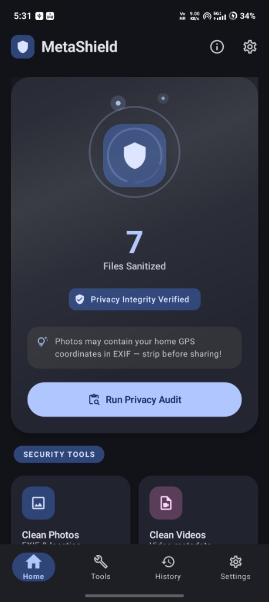
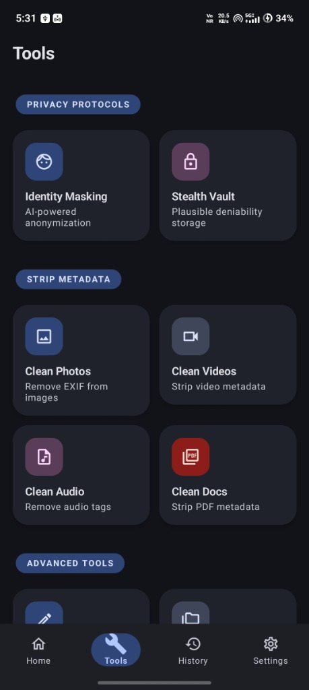
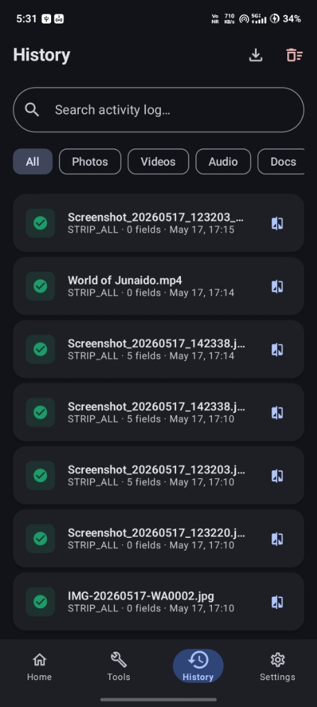
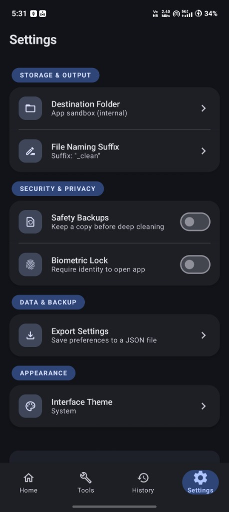

# 🛡️ MetaShield

### *Strip it. Own it. Share it safely.*

  
  
  
  

---

## 📸 App Showcase

Experience MetaShield's premium neon-infused Cyberpunk design system, responsive UI, and fluid animations:

  
  
  
  

---

## 🛡️ Your Digital Armor in a Data-Driven World

In an era where every capture and upload leaves a digital footprint, your privacy is more vulnerable than ever. **MetaShield** is a premium, high-performance Android application designed to put you back in control of your personal data. 

Every photo you take contains more than just a memory; it’s embedded with sensitive **EXIF metadata**—your precise GPS coordinates, the exact time and date of the shot, your device's unique serial number, and even the software used to edit it. Shared carelessly, this information is a map to your private life. MetaShield acts as your digital filter, stripping away these hidden vulnerabilities before they leave your device.

---

## 🚀 Core Features

### 🔹 Multi-Format Metadata Stripping
MetaShield provides comprehensive support across the digital spectrum:
*   📷 **Photos:** Cleanse JPEG, PNG, WebP, and RAW formats of EXIF and XMP data.
*   🎥 **Videos:** Remove location tags and hardware identifiers from MP4, MOV, and AVI files.
*   🎵 **Audio:** Strip ID3 tags and creator info from MP3 and FLAC recordings.
*   📄 **Documents:** Sanitize PDFs and Office files of author history and edit timestamps.

### 🔹 Precision Removal & Custom Injection
Don't want to delete everything? MetaShield offers surgical precision:
*   📍 **Location-Only Strip:** Keep the camera settings (ISO, Aperture) but erase the GPS coordinates.
*   ✍️ **Custom Metadata Editor:** Sometimes you want to *own* your data. Use our editor to inject your own copyright information or custom tags into your files.
*   📁 **Templates:** Create "Privacy Profiles" for different scenarios—one for social media, one for professional work, and one for private archives.

### 🔹 High-Velocity Batch Processing
*   ⚡ **Batch Engine:** Whether you're sharing a single vacation snap or an entire project folder, MetaShield’s multi-threaded processing engine handles hundreds of files in seconds.
*   🔄 **Non-Destructive Operations:** Your original files remain untouched while creating "Shielded" copies for sharing.

---

## ✨ A Premium "Cyber" Experience

Privacy software shouldn't feel like a chore. MetaShield features a cutting-edge **Cyber-Aesthetic UI** built with Jetpack Compose:
*   🌀 **Fluid Motion:** Every interaction is powered by snappy spring physics and staggered animations.
*   💡 **Dynamic Visuals:** Experience a "breathing" interface with pulsing status indicators and neon-infused Material Design 3 components.
*   🔑 **Biometric Security:** Protect your privacy tool with integrated App Lock, ensuring only you can access your processing history and templates.

---

## 🔒 Privacy-First Architecture

MetaShield operates on a strict **Zero-Cloud Policy**:
*   🚫 **100% Offline:** All processing happens directly on your device. Your files never touch a server, and your metadata never leaves your hand.
*   📈 **No Tracking:** We don't believe in analytics for a privacy app. No telemetry, no trackers, just pure utility.
*   📊 **Real-time Progress:** Monitor your batch tasks with real-time notifications and progress tracking.

---

## 🛠️ Technical Stack

Built with modern Android engineering standards:
*   **Language:** Kotlin (100%)
*   **UI Framework:** Jetpack Compose (Material You / MD3)
*   **Asynchrony:** Kotlin Coroutines & Flow
*   **Background Tasks:** WorkManager for reliable batch processing
*   **Architecture:** Clean Architecture with MVVM and Hilt Dependency Injection

---

## 💖 Support the Project

If you find MetaShield helpful in protecting your digital footprint and securing your privacy, please consider supporting development! Your support keeps this tool 100% offline, private, and open-source.

  
   
   
  <b>Scan the QR code above to support development efforts!</b>

---

## 🤝 Contribution & License

MetaShield is built for the community. Whether you're a privacy advocate or a developer looking to improve our processing engines, we welcome your contributions!

**License:** MIT License — Free to use, modify, and distribute.

---

*“Your data is your story. Don't let the metadata tell it for you.”*
